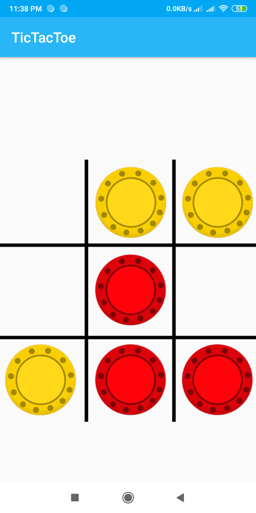
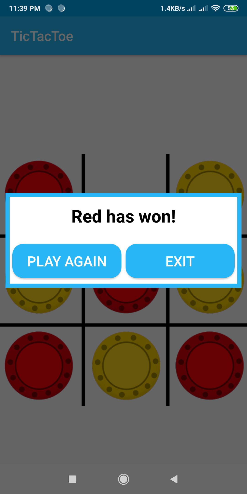
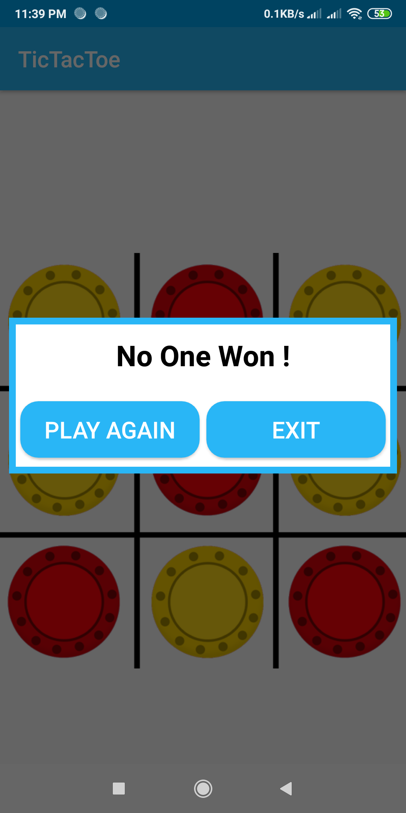

Tic-Tac-Toe
=======================
Tic-tac-toe is a  game for two players, Red and Yellow , who take turns marking the spaces in a 3×3 grid. The player who succeeds in placing three of their marks in a horizontal, vertical, or diagonal row wins the game

   
